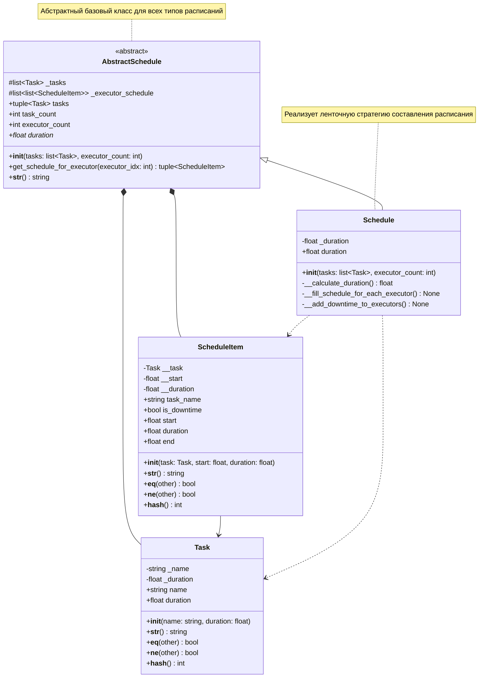

# Диаграмма классов пакета schedules

```mermaid
classDiagram
    class Task {
        -string _name
        -float _duration
        +string name
        +float duration
        +__init__(name: string, duration: float)
        +__str__() string
        +__eq__(other) bool
        +__ne__(other) bool
        +__hash__() int
    }

    class ScheduleItem {
        -Task __task
        -float __start
        -float __duration
        +string task_name
        +bool is_downtime
        +float start
        +float duration
        +float end
        +__init__(task: Task, start: float, duration: float)
        +__str__() string
        +__eq__(other) bool
        +__ne__(other) bool
        +__hash__() int
    }

    class AbstractSchedule {
        <<abstract>>
        #list~Task~ _tasks
        #list~list~ScheduleItem~~ _executor_schedule
        +tuple~Task~ tasks
        +int task_count
        +int executor_count
        +float duration*
        +__init__(tasks: list~Task~, executor_count: int)
        +get_schedule_for_executor(executor_idx: int) tuple~ScheduleItem~
        +__str__() string
    }

    class Schedule {
        -float _duration
        +float duration
        +__init__(tasks: list~Task~, executor_count: int)
        -__calculate_duration() float
        -__fill_schedule_for_each_executor() None
        -__add_downtime_to_executors() None
    }

    AbstractSchedule <|-- Schedule
    AbstractSchedule *-- Task
    AbstractSchedule *-- ScheduleItem
    ScheduleItem --> Task
    Schedule ..> Task
    Schedule ..> ScheduleItem

    note for Schedule "Реализует ленточную стратегию составления расписания"
    note for AbstractSchedule "Абстрактный базовый класс для всех типов расписаний"
```

## Описание связей:

- `<|--` : наследование
- `*--` : композиция (содержит)
- `-->` : ассоциация (ссылается)
- `..>` : зависимость (использует)