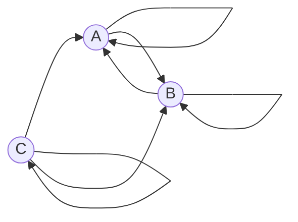

# Вариант 3 — расчёт количества маршрутов из C в B

## Условие задачи
Допустимые маршруты:
- A --> A
- A --> B
- B --> A
- B --> B
- C --> A
- C --> C
- C --> B

Найти формулу расчета количества маршрутов, начинающихся в вершине C и заканчивающихся в вершине B.

---

## Примеры для первых \(n\)

| \(n\) | Маршруты (примеры) | Количество |
|---:|---|---:|
| 0 | нет | 0 |
| 1 | (C->B) | 1 |
| 2 | (C ->A ->B), (C ->C ->B), (C ->B ->B) | 3 | (C->A), (C->B), (C->C->B), (C->B), (C->B->B) | 3 |
| 3 | (C->A->A->B), (C->A->B->B), (C->C->A->B), (C->C->C->B), (C->B->A->B), (C->B->B->B), (C->B->C->B) | 7 |

---

## Введение обозначений
Обозначим:

- \(a_n\) — количество маршрутов длины \(n\), начинающихся в C и заканчивающихся в A,
- \(b_n\) — количество маршрутов длины \(n\), начинающихся в C и заканчивающихся в B,
- \(c_n\) — количество маршрутов длины \(n\), начинающихся и заканчивающихся в C.

Начальные условия:
$$
a_0 = 0,\quad b_0 = 0,\quad c_0 = 1.
$$

---

## Система рекуррентных соотношений
Пусть мы делаем последний шаг в маршрут длины \(n\). Тогда:

$$
\begin{cases}
a_n = a_{n-1} + b_{n-1} + c_{n-1},\\
b_n = a_{n-1} + b_{n-1} + c_{n-1},\\
c_n = c_{n-1}.
\end{cases}
$$

Так как \(a_n = b_n\) для всех \(n \ge 1\), а \(c_n = 1\), система упрощается.

---

## Сведение системы к одному уравнению
Подставляем \(a_{n-1} = b_{n-1}\) и \(c_{n-1} = 1\):

$$
b_n = 2b_{n-1} + 1,\quad n \ge 1.
$$

Чтобы убрать свободный член, вычтем два соседних уравнения:

$$
b_n - b_{n-1} = 2(b_{n-1} - b_{n-2})
$$

Отсюда получаем однородную рекурсию:

$$
b_n = 3b_{n-1} - 2b_{n-2},\quad n \ge 2.
$$

Начальные условия:

$$
b_0 = 0,\quad b_1 = 1.
$$

---

## Характеристическое уравнение

$$
t^2 - 3t + 2 = 0
$$

$$
(t - 1)(t - 2) = 0,\quad t_1 = 1,\quad t_2 = 2.
$$

---

## Общее решение

$$
b_n = C_1 \cdot 1^n + C_2 \cdot 2^n = C_1 + C_2 2^n.
$$

Подставляем начальные условия:

$$
\begin{cases}
C_1 + C_2 = 0,\\
C_1 + 2C_2 = 1,
\end{cases}
\quad \Longrightarrow \quad C_2 = 1,\ C_1 = -1.
$$

---

## Итоговая формула

$$
\boxed{\,b_n = 2^n - 1\,}
$$

---

## Проверка значений

$$
b_0 = 0,\quad b_1 = 1,\quad b_2 = 3,\quad b_3 = 7
$$

Совпадает с таблицей — формула верна.
